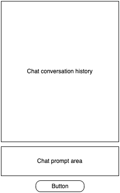

# voyage-project-techresources
Chingu Voyage Project - Technical Resource Finder

## Table of Contents

* [Overview](#overview)
* [General Instructions](#general-instructions)
* [Requirements & Specifications](#requirements-and-specifications)
* [Acknowledgements](#acknowledgements)
* [About Chingu](#about-chingu)

## Overview

Welcome, Chingus!

Regardless of what role we play in our professional life we need access to information
to help us get better in our role. This includes books, articles, and videos. But, we
are often flooded with too much information, much of which doesn't meet our needs.

In this voyage, your team will design and build a web application, _Resource Helper_, to
help software development professionals like yourself find the information you need to
reach your learning goals.

Your objective is to create a web application users will be able to access and easily
search a wide variety of links to information focused on software development extracted
from the
[#resource-treasures](https://discord.com/channels/330284646283608064/1048165970566467664) 
channel in Chingus Discord community.

An optional goal is to use the free tier of the
[Google Gemini API](https://ai.google.dev/api?lang=node) to implement an interactive AI
agent into the app to allow users to get help information. This means you will need to add 
_context_ about this app in your API calls. You can find simplified example of how to do
this in the `src` directory of this repo.

Resource Helper will help you build and refine your web development skills. It will also
let you add new skills that will help you build skills and experience using AI.

## General Instructions

This project is designed to be worked on by a team rather than an individual
Chingu. This means you and your team will need to thoroughly read and
understand the requirements and specifications below, **_and_** define and
manage your project following the _Agile Methodology_ defined in the
[Voyage Handbook](https://github.com/chingu-voyages/Handbook/blob/main/docs/guides/voyage/voyage.md#voyage-guide).

As you create this project make sure it meets all of the requirements, but once
it reaches MVP, start implementing the optional features or get creative and
extend it in ways we haven't envisioned. In other words, use the power of
teamwork to make it distinctive and unique.

Remember, UI/UX creativity is yours to explore—design an interface that stands
out while ensuring ease of use.

Also, there is no need to purchase any subscriptions or software for this project. The 
[Gemini Flash 1.5 free tier](https://ai.google.dev/pricing#1_5flash) is sufficent for the
AI part of the project and there are many 
[web hosting services](https://github.com/chingu-voyages/Handbook/blob/main/docs/resources/techresources/appdeployment.md) 
with free tiers you can use to deploy your app.

We have added a sample React app to the `src` directory of this repo you can
use to see how to call the Gemini API.

## Requirements and Specifications

### What You Need to Do

The following define the minimum requirements and ideas for features you should
implement. But, we've also included stretch goals you should use to enhance
your app once you complete these basic requirements.

#### Structure

* [ ] This is a frontend application.
* [ ] You may use any languages, tools, or libraries your team agrees on to design and build this app.
* [ ] You may use AI for research. But, you may **_NOT_** use it to create code for your app.

#### Styling

* [ ] Surprise us!!! Use your team's creativity to make this app distinctive.
* [ ] Add a footer containing a link to your team's GitHub repo.
* [ ] Recommend using this resource for [clean CSS](https://israelmitolu.hashnode.dev/writing-cleaner-css-using-bem-methodology).

#### Functionality

* Application Overview

  * [ ] Develop an application that helps users find technical information.
  * [ ] Ensure the application is user-friendly, accessible, and visually appealing.
  * The landing page contains these components:
    * [ ] A _header_ containing the name of the app and the current date
    * [ ] A _footer_ that links to your GitHub repo and a list of who is on the team.
    * [ ] A _search input form_ to allow the user to select any combination of tags and specify search terms used to select items. tags and search terms may be used by
    themselves or in combination with one another to filter the results.
    * [ ] A scrollable _search results area_ containing the search results.
    * [ ] Optionally, a _chat icon_ that will display a popup when clicked to allow the user to ask for
    help from the AI agent you build into the app.

    

    But, this wireframe doesn't provide many specifics! That's correct! Your
    task is to design your app from the detailed specifications we provide and
    apply your own styling.

* Search Input Form

  * [ ] The form must include input fields to allow users to search for resources by either tag name or words in the title of the resource.
  * [ ] The form should include a button to submit the search request.
  * [ ] The form should include a button to clear the contents of the search fields. 
  * [ ] The user must be allowed to update any search fields between submissions.
  
* Search Results Area

  * [ ] When the user clickes the submit button the Search Results Area should be updated with a list of the resources matching the search criteria.
  * [ ] Since the number of resources to be display could be large you should paginate the results display -- display a subset of the results and allow the user to page forward and backward through them a page at a time.
  * [ ] It is valid for the user to enter any combination of search fields or none at all to retrieve all resources.
  * [ ] When the clear button is clicked in the search input form any results from a prior query should be cleared 

* Resources Server API

  Your app must use the Resources Server (`https://seshatbe.up.railway.app`) we've provided to retrieve
  the tag list and resources from the
  [`#resource-treasures` channel](https://discord.com/channels/330284646283608064/1048165970566467664)
  in the Chingu Discord server. The routes this server supports are:

  * Tag List:</br>
    **Route**: `/tags`
    **Returns**: Array of JSON elements in the format:
    ```
    [
      {"tag":"General","id":"1048176100892737618"},
      {"tag":"HTML","id":"1048172063774486548"},
      ...
    ]
    ```

  * Resources: </br>
  **Route**: `/resources`
    **Returns**: Array of JSON elements in the format:
    ```
    [
      {
        "author":"andresc1310",
        "name":"Lazygit",
        "appliedTags":["1048174499905937428"],
        "url":"https://www.freecodecamp.org/news/how-to-use-lazygit-to-improve-your-git-workflow/",
        "createdAt":"2025-04-12T18:04:11.224Z",
        "id":"1360676892071559340"
      },{
        "author":"jdmedlock",
        "name":"Faster shuffling in Go with batching",
        "appliedTags":["1303349202444615730"],
        "url":"https://lemire.me/blog/2025/04/06/faster-shuffling-in-go-with-batching/",
        "createdAt":"2025-04-10T18:39:07.722Z",
        "id":"1359960909690175570"
      }, {
      ...
    ]
    ```

    Don't be surprised! The server will only return a limited number of the most
    recently added resources in the `#resource-treasures` channel.

* Optional - AI Chat Icon

  * [ ] When clicked, display a popup dialog to allow the user to chat with the AI about this application. This conversation is intended to replace traditional documentation. Instead, it let's the user ask questions like "What tags can I search for?" and "How can I scroll through the results?".
  * [ ] The popup dialog has three components to support this:

      

    - A conversion display area that contains a infinite scroll containing the questions the user asked followed by the response from the AI.
    - An input field where the user may enter their question
    - A button the user may click to submit their question.

    To implement this requirement you'll need to use the
    [Google Gemini API](https://ai.google.dev/api?lang=node) to create a context for your
    application and to allow the users to ask questions using it. You can find and example
    of how to do this in the `src` directory of this repo. 

    This is just an example, for your app you will need to create context information about
    it Google Gemini will use to answer your users questions.

* Validation and Error Handling

  * [ ] Display an error message for invalid inputs (e.g. an undefined tag).
  * [ ] The user must be informed about errors at the time they are detected.
  * [ ] Error messages should be cleared when they are corrected.

* User Interface and Experience (UI/UX)

  * [ ] In general, you will find these [UI design principles](https://www.justinmind.com/ui-design/principles) helpful.
  * [ ] If your team doesn't include a dedicated UI/UX Designer you will [find
these tips](https://github.com/chingu-voyages/Handbook/blob/main/docs/resources/techresources/uiux.md)
helpful.

### Stretch Goals (Not Required)

Once you complete the basic application you may enhance it with any of the
following _optional_ stretch goals. Make sure that any of these you choose
match the capabilities of your tier.

* [ ] Add an AI chatbot users can utilize to get help using the application.
Although this is and optional requirement, we strongly suggest Tier 2 & Tier 3
teams attempt this. 

* [ ] Enhance the search capability by allowing any or all of the following: 
  - Allow the user to specify partial words for a title search
  - Allow the user to search by author name, in addition to category and title

* [ ] Personalize the application by collecting the user's name and including it
in labels, alerts, and error message.

* [ ] Implement full-stack application that makes the calls to the Gemini API
via a BE route. Frontend and backend are required.

* [ ] Implement a user signup & login feature.

* [ ] Authenticate users via Google or GitHub OAuth to increase the security of your app.
  * [Github Authentication](https://www.npmjs.com/package/oauth-client-github)
  * [Google Authentication](https://developers.google.com/identity/gsi/web/guides/get-google-api-clientid)
  A detailed guide on how to obtain an API key and perform Google Authentication.

* [ ] Add functionality to print and/or email the results to the user. Check out
[EmailJS](https://www.emailjs.com/docs) for how you might email them.

* [ ] Surprise us with any features you would like to add to this app! Brainstorm
with your teammates to see what you can come up with.

## Acceptance Criteria

* [ ] You should include a good readme in your project repo.
* [ ] Add acceptance criteria to your readme for any stretch goals you choose
to implement.
* [ ] Users can enter data into the input form, submit it, and formatted
results will be displayed.
* [ ] Error messages are displayed at the time an error is detected. These
should be clear and provide advice for how to correct the error
* [ ] The UI provides clear feedback for invalid inputs.
* [ ] The UI should be responsive
* [ ] The results returned from Gemini are displayed in a clear and readable
fashion.

## Acknowledgements

We would like to express our profound gratitude to the global developer
community, whose collaborative spirit and shared knowledge continually
motivate and enrich our endeavors. Together, we achieve extraordinary
milestones. Thank you.

## About Chingu

If you aren't yet a member of Chingu we invite you to [join us](https://chingu.io).
We help ourmembers transform what they've learned in courses & tutorials into the
practical experience employers need and want. The experience that helps to set you
apart from other applicants for the same jobs.
